# Is College Worth the Cost?  

## Overview  
* The college experience is a rite of passage for nearly all high school students, with social and parental pressure to "make something of yourself". There have been multiple studies completed demonstrating that indeed one's lifetime earnings for the college educated exceed that of non college educated individuals. However, with a job market saturated with college graduates, recent studies have shown that college graduates are largely underemployed (IHE). This means they often take and remain in jobs that don't require a degree. So what exactly determines the worth of a college degree?
* The value proposition of college has historically been unquestioned. However, recently, with rising tuition rates, increasing student debt, and greater saturation of degree holders in the job market (Champlain), it is less clear whether the value in a college degree is worth it. The main considerations would be whether the salary potential is worth the cost of tuition for a degree and the debt repayment required. 
* We created several deep learning models to look at the important features in determining a successful return on investment for college attendance, for example:
  * Public/private control
  * Mean earnings 6 and 10 years post graduation
  * Debt amount and loan repayment
  * College admittance and expenditure per student

## Tools Used
  * TensorFlow
  * Pandas
  * MatPlotLib
  * Numpy
  * SKLearn
  * Linear Regression
  * Random Forest Regressor

## Data Sources
https://www.kaggle.com/datasets/kaggle/college-scorecard
* Data used in this analysis was found from this source. More recent data can be found on the college scorecard US Department of Education website, linked here. The size of the file used is prohibitive for sharing on github, but can be found here.

https://collegescorecard.ed.gov/data/

* The college scorecard data dictionary excel file was used to determine what the columns in the dataset actually mean, and assisted in determining which columns to use in the analysis. 

https://collegescorecard.ed.gov/assets/CollegeScorecardDataDictionary.xlsx

## Cleaning Process

* Data was very messy initially, and needed to be cleaned to be workable. 
* First, there were many columns whose values were suppressed for privacy, and which needed to be replaced with a blank value. 
* Null values were dropped in the target column for the most original values, and other null values in numerical columns were replaced with the column mean. 
   
## Model 1:  
* This first model was done looking at these features, with the target as the calculated field "ROI" which considered salary and debt. 

* Features 

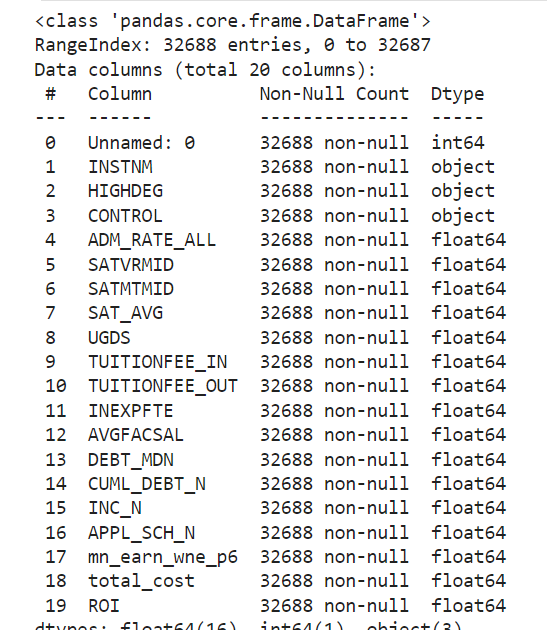

The target was ROI, which was calculated like this.

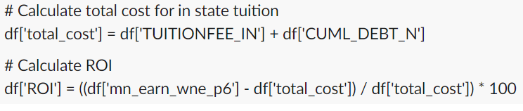

* Architecture: 

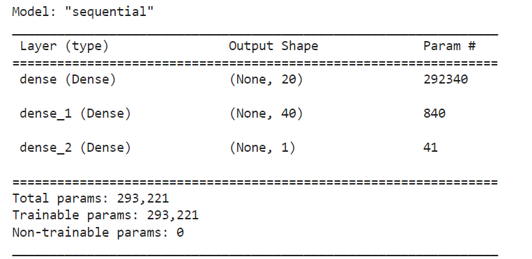

* Predictions With One Output Layer: 

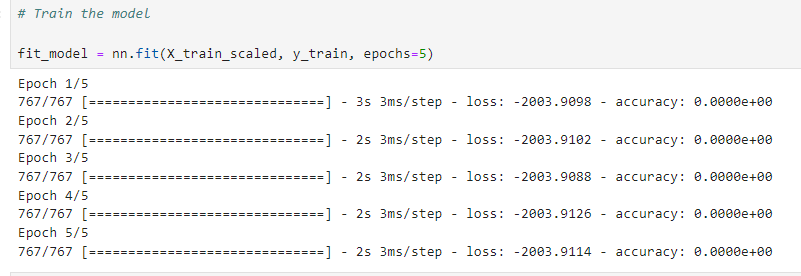 

* The model performed very suspiciously, with values of 94.15% for each training epoch and negative loss.

* Top Feature Importances: 
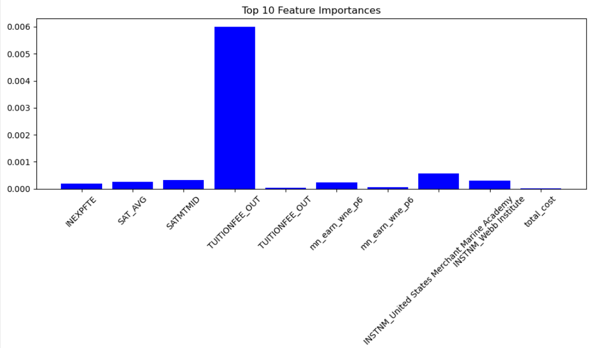
 

* Model Predictions With One Output Layer: 
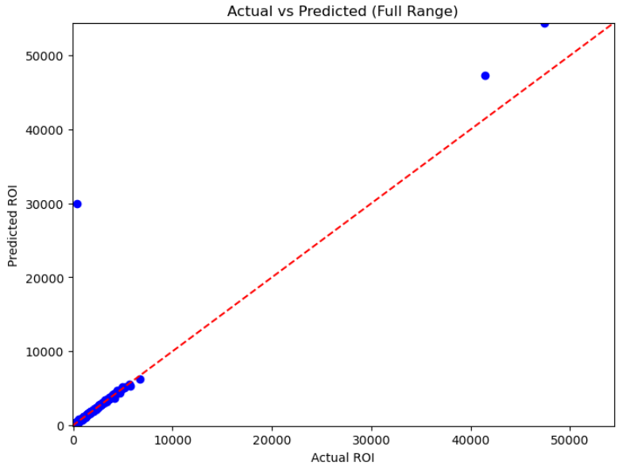
 

* Model evaluation:  
  * Mean Absolute Error: 68202.69008352426
  * Mean Squared Error: 9290541773.416914
  * Root Mean Squared Error: 96387.45651492685  

* While the values of predicted vs actual ROI were fairly linear, there was an extreme amount of error within the evaluation

## Model 2:  
* In this model, to correct for loss leakage drop out rates were added and a second output layer added to improve accuracy:
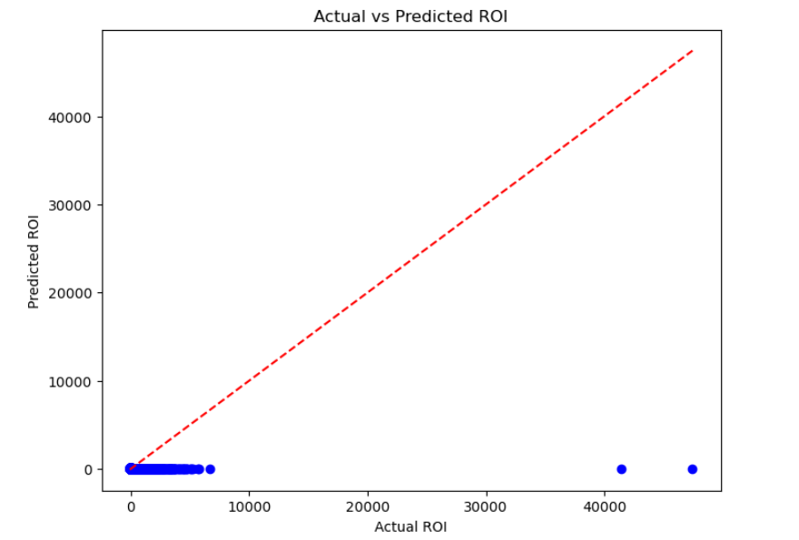 

* Model Evaluation:  
 * 256/256 - 0s - loss: -2.0165e+03
 * - accuracy: 0.9422
 * - 347ms/epoch - 1ms/step
 * Loss: -2016.5423583984375
 * Accuracy: 0.9422417879104614  
 * Mean Absolute Error: 130.5268270320259
 * Mean Squared Error: 369534.07959854195
 * R-squared: -405.8856610447764

* This model was more accurate, but still had a lot of error, and a negative loss. This indicates a lot of error within this models predictive ability, despite a high accuracy. A different approach will be used to further optimize the model.

## Model 3:  

* Different columns were selected in this model, with the target set based on the mean earnings of the students 6 years post graduation. 
* When converting to numerical values using the pandas function "get_dummies", several columns were adding a lot of uncertainty and "noise" into the model, and thus were dropped. These referred to institution name, zip code and city. 

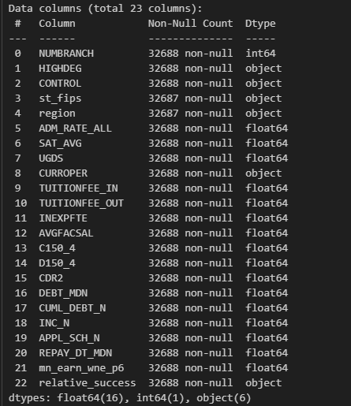

* The column "relative success" was created based on the threshold of $30,000 income per year, 6 years after completion. The model target was determined by whether or not this threshold was met, and if meeting this threshold can be predicted. 

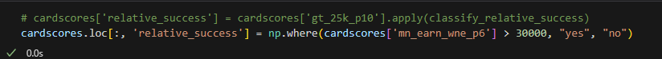

* This was the architecture used for this model, and the amount of parameters have diminished significantly, with cells running in a matter of seconds, not minutes.

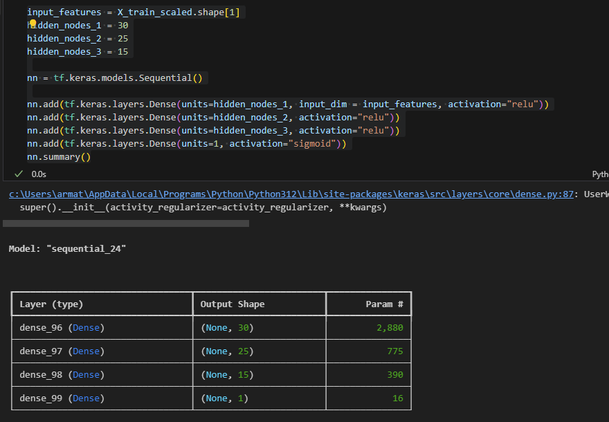

* Accuracy on test data was fairly good, with 80% accuracy

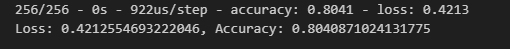

* With a random forest regressor, the mean squared error and r squared value were determined from the dataset, to check for error. These values were very low. 

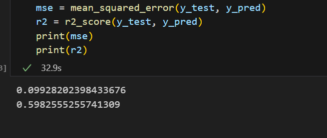

* The feature importances were also looked at, with the offering of a graduate degree, application for financial aid and median debt being the most improtant factors.

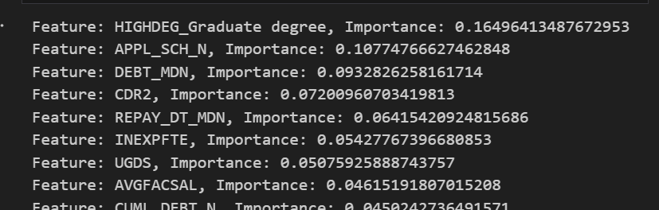

* With greater feature reduction, it is interesting to see which features are the most important, and if they would remain as important with a slightly modified target.

## Model 4

* The final model looked at earnings 10 years after college, along with remaining debt. We believe that with by the 10 year point, with a good salary and a small amount of remaining debt, the value of the college can be better identified. This is how the target column was set up.

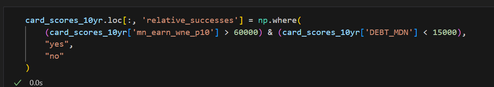

* The model architecture for the fourth model was identical to the third. 

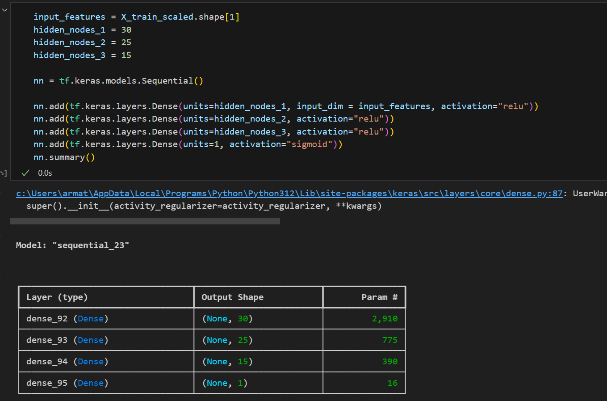

* The models performance was very good! 

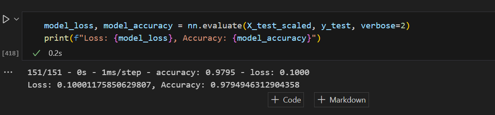

When taking debt into consideration, the model found the students who applied for financial aid, those with reported family income, and those with cumulative debt to be the most important features. 

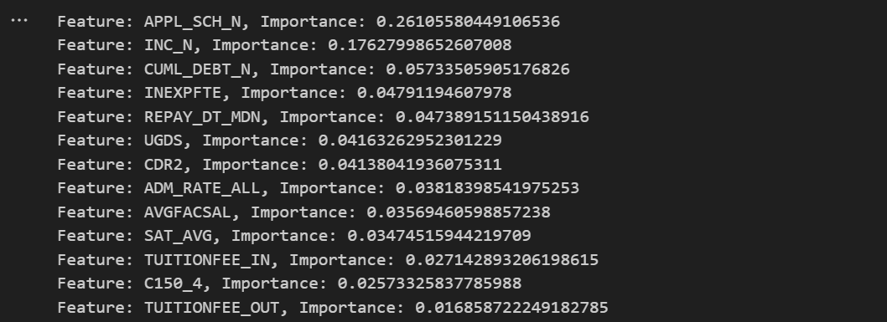

Including these features increased the models performance significantly, and with a small error and loss, performed satisfactorily for our purposes.

## Additional Visualizations

### Comparing Top Earning Schools to Median Debt

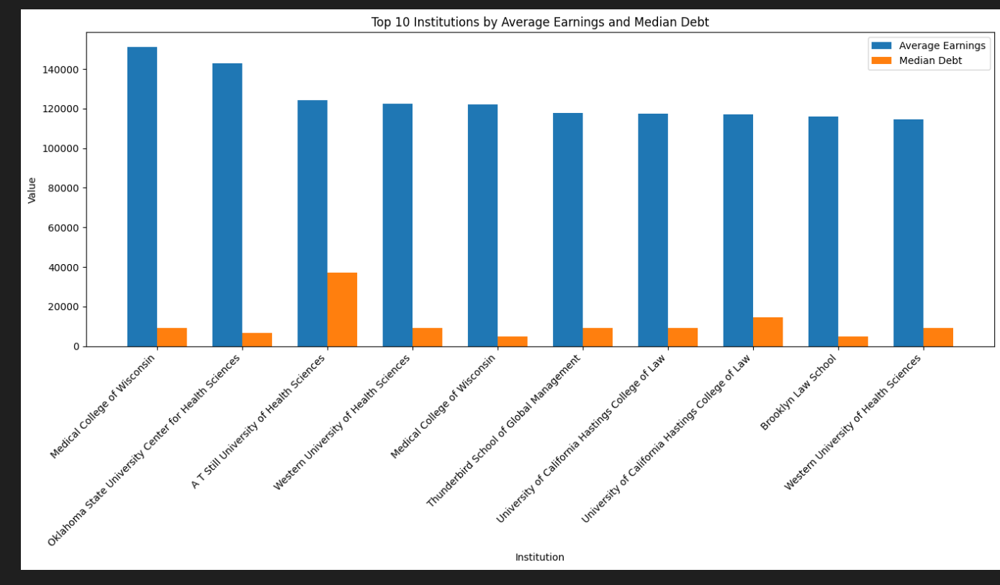

### Comparing Lowest Earning Schools to Median Debt

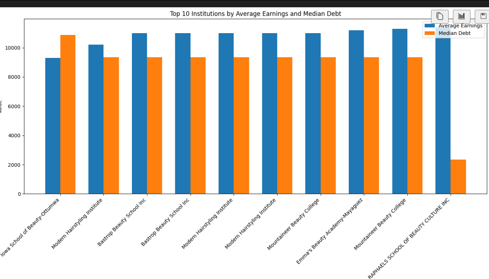

# Conclusion:  
* College is expensive, and earnings are generally lower than one would expect
* A graduate degree is worth more than a bachelors degree
* Further analysis would be interesting to classify earnings by major, and future career
* Changing items such as the features our models were using, most notably adding drop out rates, and increasing training time all contributed to small improvements in the models
* Finding columns that were slowing down model performance helped significantly in future optimization, as each cell took seconds, not minutes
* It would be interesting to see similar data on students without higher education to make more definitive claims, but your future success can be predicted fairly accurately by the college you attend.
* Going forward, it would be interesting to look into job requirements for post college earnings.

# Works Cited  
* [Knox magazine](https://www.knox.edu/magazine/spring-2018/features/yes-college-is-worth-it)) 

https://online.champlain.edu/blog/is-college-worth-the-cost

https://www.insidehighered.com/news/students/academics/2024/02/22/more-half-recent-four-year-college-grads-underemployed 
