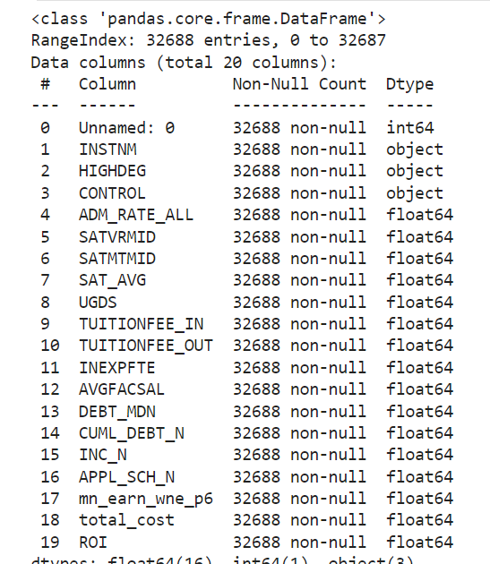
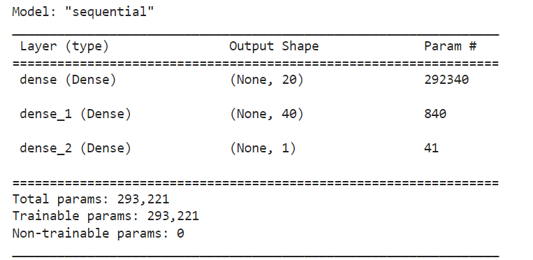
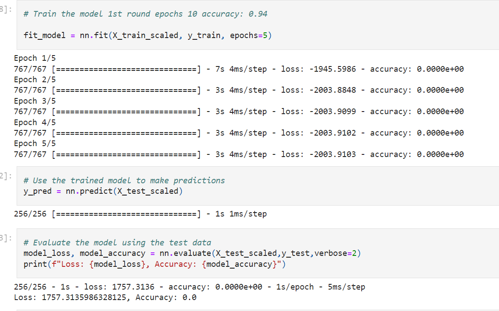
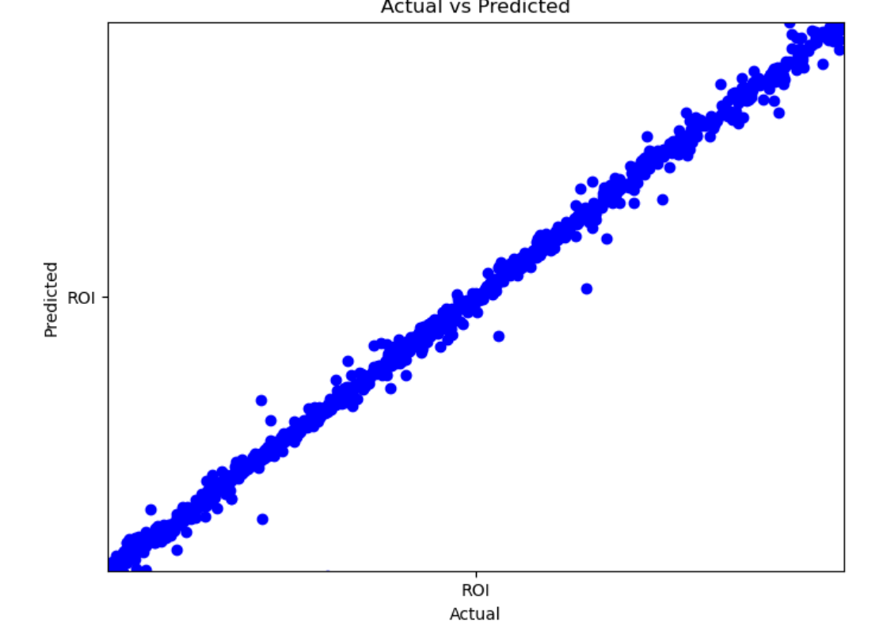

# Project Scope 
## Is College Worth the Cost?  

## Overview  
* The college experience is a rite of passage for nearly all high school students, with social and parental pressure to "make something of yourself". There have been multiple studies completed demonstrating that indeed one's lifetime earnings for the college educated exceed that of non college educated individuals. But what exactly determines the worth of a college degree?
* The value proposition of college has historically been unquestioned. However, recently, with rising tuition rates, increasing student debt, and greater saturation of degree holders in the job market (Champlain), it is less clear whether the value in a college degree is worth it. The main considerations would be whether the salary potential is worth the cost of tuition for a degree and the debt repayment required. 
* We created several deep learning models to look at the important features in determining a successful return on investment for college attendance, for example:
  * Public/private control
  * Mean earnings 6 and 10 years post graduation
  * Debt amount and loan repayment
  * College admittance and expenditure per student

## Tools Used
  * TensorFlow
  * Pandas
  * MatPlotLib
  * Numpy
  * SKLearn
  * Linear Regression
  * Random Forest Regressor

## Data Sources
https://www.kaggle.com/datasets/kaggle/college-scorecard
* Data used in this analysis was found from this source. More recent data can be found on the college scorecard US Department of Education website, linked here. The size of the file used is prohibitive for sharing on github, but can be found here.
https://collegescorecard.ed.gov/data/
* The college scorecard data dictionary excel file was used to determine what the columns in the dataset actually mean, and assisted in determining which columns to use in the analysis. 
https://collegescorecard.ed.gov/assets/CollegeScorecardDataDictionary.xlsx
   
## Model 1:  
* This first model was done looking at these features, with the target as the calculated field "ROI" which considered salary and debt. 

* Features

* Architecture: 

* Predictions With One Output Layer:

* The model performed very poorly, with a high loss and 0% accuracy. 
## Model 2:  
* The second model was compiled with Random Forest with one output layer and the same features of model 1 

* Top Feature Importances: 

 

* Model Predictions With One Output Layer: 

 

* Model evaluation:  
  * Mean Absolute Error: 68202.69008352426
  * Mean Squared Error: 9290541773.416914
  * Root Mean Squared Error: 96387.45651492685  

* While the values of predicted vs actual ROI were fairly linear, the 

## Model 3:  
* In this model, to correct for loss leakage drop out rates were added and a second output layer added to improve accuracy:
 

* Model Evaluation:  
 * 256/256 - 0s - loss: -2.0165e+03
 * - accuracy: 0.9422
 * - 347ms/epoch - 1ms/step
 * Loss: -2016.5423583984375
 * Accuracy: 0.9422417879104614  
 * Mean Absolute Error: 130.5268270320259
 * Mean Squared Error: 369534.07959854195
 * R-squared: -405.8856610447764

  

## Model 4 Final Model:  

# Conclusion:  
* Modeling is an iterative process
* Changing items such as the features our models were using, most notably adding drop out rates, and increasing training time all contributed to small improvements in the models

# Works Cited  
* [Knox magazine](https://www.knox.edu/magazine/spring-2018/features/yes-college-is-worth-it)) 

# Data and Research Sources  
* Dataset for this project was downloaded [here](https://www.kaggle.com/datasets/rounakbanik/the-movies-dataset?select=ratings.csv) 
