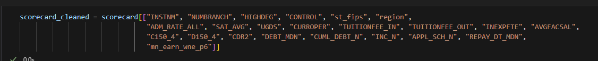

# college_salary_predictor

## Is College Worth It?

The college experience is a rite of passage for nearly all high school students, with social and parental pressure to "make something of yourself". The value proposition of college has historically been unquestioned. However, recently, with rising tuition rates, increasing student debt, and greater saturation of degree holders in the job market (Champlain), it is less clear whether the value in a college degree is worth it. The main considerations would be whether the salary potential is worth the cost of tuition for a degree. 

## Tools Used

* TensorFlow
* Pandas
* MatPlotLib
* Numpy
* SKLearn
* Linear Regression
* Random Forest Regressor

## Analysis Overview

In this analysis, we use the college scorecard dataset to see if we can predict the salary potential of college graduates. The dataset started with 125,000 rows and 1800 columns, with data on colleges from the years of 1996 to 2013. The data included information on high school performance, college admission rate, tuition costs, college expenditures per student, debt and income post graduation, repayment success post graduation, grant information, and many other things! For greater efficiency, the columns used for modeling in this analysis were reduced to a smaller subset. 

## Data Finding and Cleaning Process

https://www.kaggle.com/datasets/kaggle/college-scorecard

Data used in this analysis was found from this source. More recent data can be found on the college scorecard US Department of Education website, linked here.

https://collegescorecard.ed.gov/data/

The college scorecard data dictionary pdf was used to determine what the columns in the dataset actually means, and assisted in 

## Model 1

The selected columns included the institution name, number of branches, highest degree offered, public or private status, admissions rate, average SAT, student population, if the college is currently open, tuiton (in and out of state), institution expenditure per student, faculty salary, completion rate, default rate, debt median, students in the cumulative debt cohort, students with reported family income, students who have applied for financial aid, median date the student enters repayment, family income, age of entry, and the mean earnings 6 years post graduation

